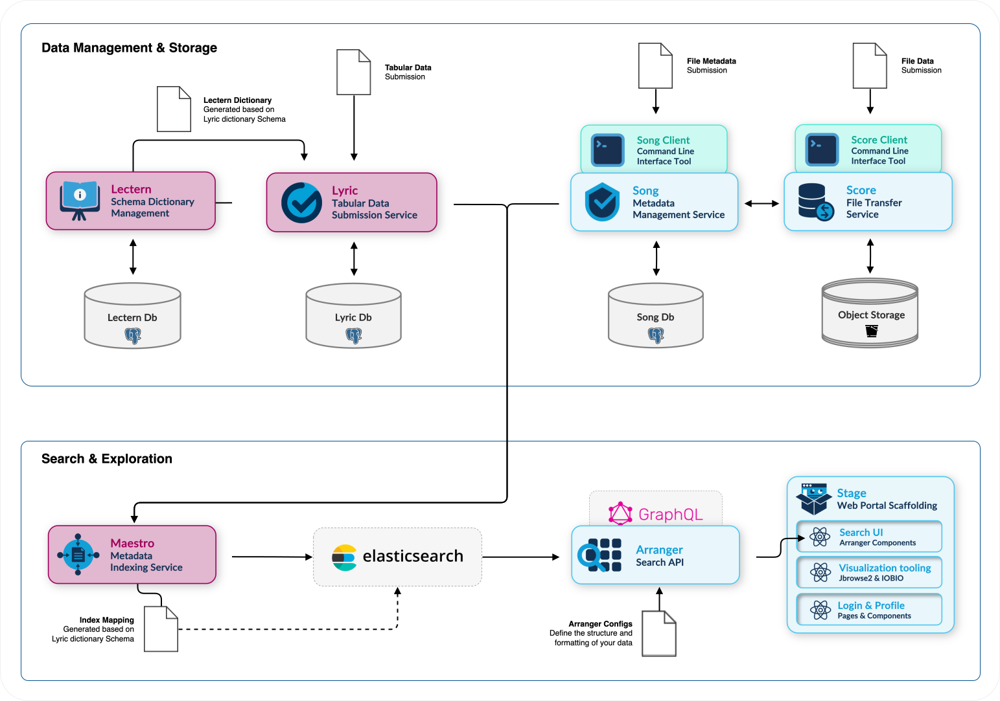

# Overview

Lyric is a model-agnostic, tabular data submission service designed to manage and validate structured clinical and research data. Built on top of [Lectern's](/develop/Lectern/overview) dictionary framework, it provides a system for organizations to submit, validate, and manage structured data according to predefined schemas. While primarily used for clinical data management, Lyric's architecture remains domain-agnostic, allowing it to handle any type of structured data that can be defined within a Lectern dictionary.

## Key Features

- **Schema-driven validation:** Uses Lectern dictionaries to enforce data structure and relationships, validating submissions of tabular data files against predefined schemas.
- **Flexible submission workflow:** Provides a staged submission process where users can iteratively update and validate their data before committing to the database.
- **Comprehensive data management:** Offers complete CRUD operations (Create, Read, Update, Delete) through a RESTful API documented in Swagger.
- **Detailed change history:** Maintains a complete audit trail of all data modifications, tracking changes from committed submissions and updates ensuring data governance and accountability.
- **SQON query endpoint:** Provides an endpoint for SQON (Structured Query Object Notation) based queries allowing complex search operations through combinations of simple field operations (`in`, `<=`, `>=`) and logic (`and`, `or`, `not`). This allows complex queries to be expressed in a simple JSON format.
- **Multi-dictionary support:** Handles multiple Lectern dictionaries simultaneously, allowing organizations to manage different data categories with distinct schemas while maintaining data integrity and relationships. A category can optionally be given an alias, a human-readable identifier usable anywhere a numeric category ID is accepted.

## System Architecture

Lyric manages the submission of tabular data through its API, validating submissions based on Lectern dictionary schemas stored within Lyric and specified on submission. [Song](/develop/Song/overview) will interact with Lyric to confirm the presence of the data in Lyric's database that corresponds to the file metadata being submitted to Song. All Lyric data is stored on the backend within a PostgreSQL database. On commit, Lyric publishes each affected record as a document to a Kafka topic, which [Maestro](/develop/Maestro/overview) consumes to index into Elasticsearch. Maestro also supports a pull-based full re-index from Lyric's REST API as a recovery path.



:::info Why Elasticsearch?
Storing data in Elasticsearch allows us to build powerful search UI components linked to a flexible GraphQL API facilitated by the Arranger Server. This approach delivers enhanced query performance, advanced full-text search capabilities, and flexible filtering options compared to querying the database directly.
:::

As part of Overture, Lyric is typically used with additional integrations, including:

- **[Lectern](/develop/Lectern/overview):** Validates, stores, and manages the dictionary schemas fetched, stored, and used by Lyric.
- **[Maestro](/develop/Maestro/overview):** Consumes Lyric's Kafka document topic to index committed records into Elasticsearch.
- **[Song](/develop/Song/overview) & [Score](/develop/Score/overview):** Facilitate the submission, validation, and management of file data in object storage (Score) and the corresponding file metadata (Song) in a database.

## Repository Structure

The repository is a PNPM monorepo, organized with deployable applications under `apps/` and shared libraries under `packages/`:

```
.
├── apps/
│   └── server
└── packages/
    ├── data-model
    └── data-provider
```

[Click here to view the Lyric repository on GitHub](https://github.com/overture-stack/lyric)

- `apps/`: Standalone, deployable processes. Published to [ghcr.io](https://ghcr.io) as container images.
  - `server/`: The Lyric server application — an Express-based REST API (documented with Swagger) exposing the submission, validation, query, and data-management endpoints.
- `packages/`: Reusable libraries shared between applications. Published to [NPM](https://npmjs.com).
  - `data-model/`: The PostgreSQL data model and database migrations (`@overture-stack/lyric-data-model`).
  - `data-provider/`: The core data-access and business-logic library that backs the server, including submission processing, validation, and audit-history handling.
