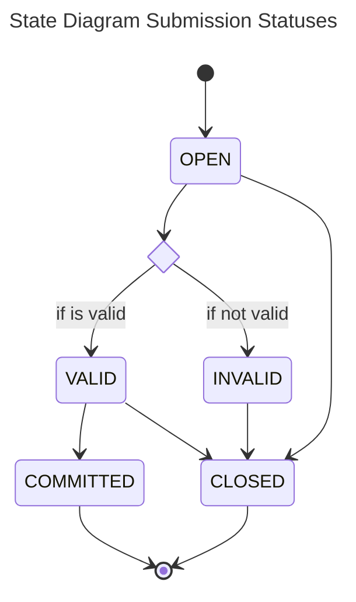

```mermaid
---
title: State Diagram Submission Statuses
---
stateDiagram-v2
    [*] --> OPEN
    state if_state <<choice>>
    OPEN --> if_state
    if_state --> VALID: if is valid
    if_state --> INVALID: if not valid
    VALID --> COMMITTED
    VALID --> CLOSED
    INVALID --> CLOSED
    OPEN --> CLOSED
    COMMITTED --> [*]
    CLOSED --> [*]
```
