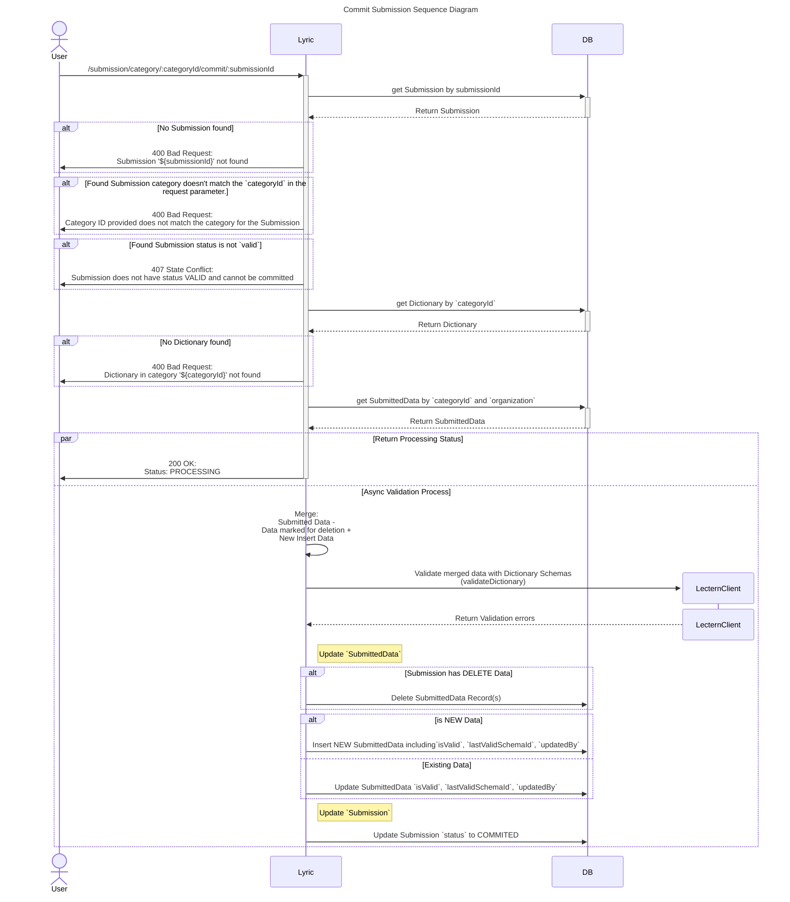

```mermaid
---
title: Commit Submission Sequence Diagram
---
sequenceDiagram
    actor User

    User->>+Lyric: /submission/category/:categoryId/commit/:submissionId
    Lyric->>+DB: get Submission by submissionId
    DB-->>-Lyric: Return Submission

    alt No Submission found
        Lyric->>User: 400 Bad Request:<br />Submission '${submissionId}' not found
    end

    alt Found Submission category doesn't match the `categoryId` in the request parameter.
        Lyric->>User: 400 Bad Request:<br />Category ID provided does not match the category for the Submission
    end

    alt Found Submission status is not `valid`
        Lyric->>User: 407 State Conflict:<br />Submission does not have status VALID and cannot be committed
    end

    Lyric->>+DB: get Dictionary by `categoryId`
    DB-->>-Lyric: Return Dictionary

    alt No Dictionary found
        Lyric->>User: 400 Bad Request:<br />Dictionary in category '${categoryId}' not found
    end

    Lyric->>+DB: get SubmittedData by `categoryId` and `organization`
    DB-->>-Lyric: Return SubmittedData

    par Return Processing Status

        Lyric->>-User: 200 OK:<br />Status: PROCESSING

    and Async Validation Process
        
        Lyric->>Lyric: Merge:<br />Submitted Data -<br />Data marked for deletion +<br />New Insert Data

        create participant LecternClient

        Lyric->>LecternClient: Validate merged data with Dictionary Schemas <br />(validateDictionary)
        destroy LecternClient
        LecternClient-->>Lyric: Return Validation errors

        note right of Lyric: Update `SubmittedData`

        alt Submission has DELETE Data
            Lyric->>DB: Delete SubmittedData Record(s)
        end

        alt is NEW Data
            Lyric->>DB: Insert NEW SubmittedData including`isValid`, `lastValidSchemaId`, `updatedBy`
        else Existing Data
            Lyric->>DB: Update SubmittedData `isValid`, `lastValidSchemaId`, `updatedBy`
        end

        note right of Lyric: Update `Submission`

         Lyric->>DB: Update Submission `status` to COMMITED
    end

```