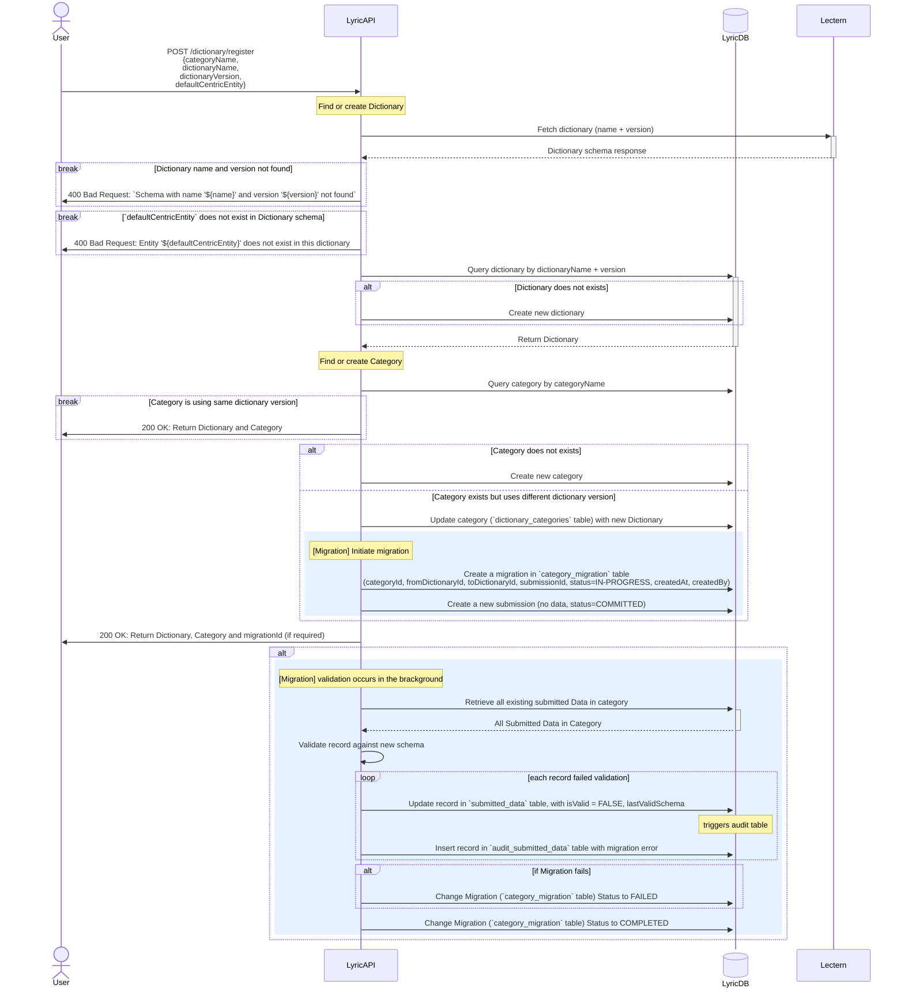

# Dictionary Registration

> Note: [Overture Lyric](https://github.com/overture-stack/lyric) depends on [Overture Lectern](https://github.com/overture-stack/lectern) to fetch dictionaries.

## Overview

A **Dictionary** defines the structure of data to be stored.

Dictionary schemas are fetched from **Lectern** and persisted in the **Lyric database**.

Dictionary registration is responsible for:

- Registering or updating dictionary

- Creating or updating categories

- Triggering data migration

## Dictionary Registration

The `POST /dictionary/register` endpoint allows Lyric to fetch and register dictionary metadata, create a category if required, and set configuration parameters such as the default centric entity.

Request Body:

```json
{
	"categoryName": "string",
	"dictionaryName": "string",
	"dictionaryVersion": "string",
	"defaultCentricEntity": "string"
}
```

### Sequence Diagram:



## Category Management

A Category is uniquely identified by its case-sensitive `categoryName`.

Category groups data that is related and shares the same data structure, for that reason, a category must be associated to a registered dictionary. Over time, if the dictionary requires an update, the category needs to be updates accordingly, See [Dictionary Migration](#dictionary-migration) for more details.

## Centric entity

Some dictionaries define a centric entity, representing the root of the data model hierarchy (used on compound views).

- `defaultCentricEntity` indicates the parent/root entity for nested data structures.

- It is used when compound data is requested. The system organizes entities by relational dependencies to produce hierarchical JSON.

If omitted or empty:

- The dictionary is considered non-centric and will not produce compound hierarchical responses.

## Dictionary Migration

When a dictionary definition is updated in Lectern, Lyric allows an existing category to be upgraded to use the new dictionary version.

### Migration execution

#### To initiate a dictionary migration:

- Use the registration endpoint `POST /dictionary/register` using the same `categoryName`, and providing a new `dictionaryVersion`.

#### When a migration starts:

- The endpoint returns a `migrationId`, representing a new migration job.

- A migration entry is created with the initial status `IN-PROGRESS`.

- Since migrations run asynchronously, the status is updated to `COMPLETED` once processing finishes.

#### During the migration process:

- All existing records associated to the specified category are revalidated against the updated dictionary schema.

- Each record is evaluated, resulting in:
  - `isValid` property is updated to indicate whether the record still conforms to the new dictionary

  - If record fails:
    - A corresponding audit entry is registered to capture the details validation errors linked to the migration.
